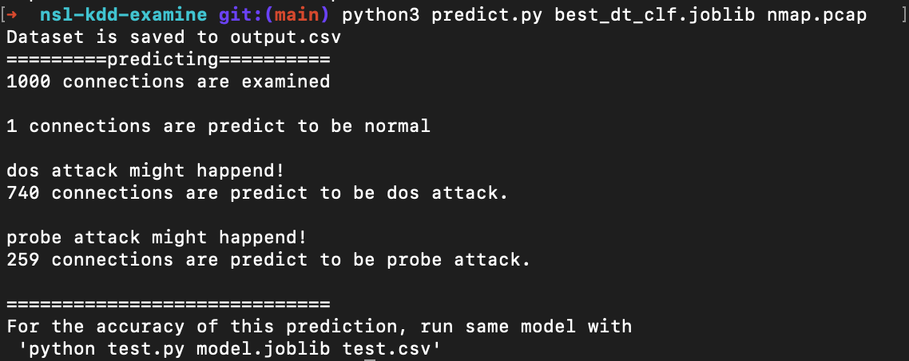

# nsl-kdd-examine
Anomaly intrusion detection system

## Setup
### Installing tools
```shell
# Install zeek for running the bro scripy
# https://docs.zeek.org/en/master/install.html for further details
brew install zeek # with brew
```
### Installing dependencies
```shell
pip install -r requirements.txt
```

## Run
```shell
# The .pcap is the network traffic data, which can be replaced by any .pcap format file
python predict.py best_dt_clf.joblib nmap.pcap
# or
python predict.py model1 nmap.pcap
```


## Notes
If you want to test the program performance with the NSK-KDD test dataset, please run: 
```shell
python test.py vote_clf.joblib test.csv

#or
python test.py model1 test.csv
```
  

  
   
